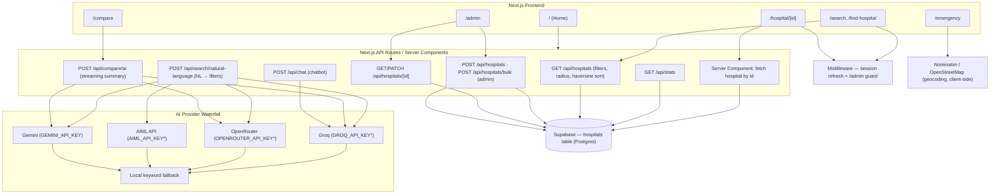

# CuraNav

**AI-Powered PM-JAY Hospital Discovery**

Search, compare, and navigate PM-JAY empanelled hospitals across India. Compare costs, outcomes, and certifications — powered by transparent AI. Built for **TECHNOVA 2026**.

## Table of Contents

- [Overview](#overview)
- [Features](#features)
- [Technology Stack](#technology-stack)
- [System Architecture](#system-architecture)
- [Project Structure](#project-structure)
- [Pages & Routes](#pages--routes)
- [API Routes](#api-routes)
- [Data & Database](#data--database)
- [Environment Variables](#environment-variables)
- [Getting Started](#getting-started)
- [Project Scripts](#project-scripts)
- [Security Notes](#security-notes)
- [Deployment](#deployment)

## Overview

CuraNav helps patients and caregivers discover **Ayushman Bharat PM-JAY empanelled hospitals** using both natural-language AI search and structured filters.

The platform addresses a real-world problem: government-published hospital directories (such as NHA's Health Empanelment Module at `hem.nha.gov.in`) are hard to browse, have no patient-friendly comparison tools, and give no sense of cost, outcomes, or available facilities. CuraNav imports this public dataset, lets users search in plain language ("cardiac surgeon with ICU under ₹50,000 in Delhi"), explains *how* it interpreted the query, and lets them compare hospitals side-by-side with an AI-generated summary.

Data is seeded with **274 real PM-JAY empanelled records** imported from the official NHA CSV exports, then enriched with coordinates, success rates, and cost estimates.

## Features

- **Natural-language search** — type a query and the AI extracts structured filters (city, specialty, condition, budget, facilities) and shows an *explainability panel* so you can see exactly what it understood and edit it.
- **Manual search & filters** — find hospital via city, condition, specialty, budget range (₹), facilities (ICU / Emergency / Dialysis / NICU), and radius around your location.
- **Location-aware results** — uses browser geolocation (reverse-geocoded via Nominatim), persisted in local storage, and supports distance-based sorting.
- **Hospital comparison** — pick up to 5 hospitals from any results page, open them in a `Compare` view, and stream an AI summary that highlights trade-offs.
- **Hospital detail pages** — cost range, specialties & procedures, facilities, accreditations, PM-JAY status, annual procedure volume, reported success outcomes, verification badge, and trust data.
- **Emergency flow** — a one-time-per-session emergency gate routes users to the nearest emergency-capable hospitals plus national helplines.
- **Transparent AI cost estimates** — per-specialty estimated cost ranges surfaced during search (see `src/lib/costEstimator.ts`).
- **On-site chatbot** — a context-aware assistant mounted on every page that answers questions using the visible page content.
- **Live platform stats** — real counts (hospitals, specialties, cities, verified/PM-JAY facilities) fetched from `/api/stats`.
- **Admin moderation** — a protected dashboard to approve/reject/review hospital records, verify data, add a single hospital, or bulk-import via CSV. Any authenticated Supabase user can access `/admin`.
- **Trust & verification** — every record carries a `verification_status` and per-condition success rates, surfaced as badges and explainer chips on cards.

## Technology Stack

| Layer | Technology |
| --- | --- |
| Framework | Next.js 16 (App Router, `src/` directory) |
| UI Library | React 19, TypeScript 5 |
| Styling | Tailwind CSS 4, `tw-animate-css` |
| UI Components | shadcn/ui-style primitives ("base-nova" theme) built on `@base-ui/react` |
| Motion & Icons | framer-motion, lucide-react |
| Database | Supabase (PostgreSQL) |
| Auth | Supabase Auth (email + password) |
| AI Providers | Google Gemini (`@google/genai`) + Groq, OpenRouter, AIML API (OpenAI-compatible `chat/completions`) |
| Data Ingestion | papaparse (CSV import scripts), Nominatim (OpenStreetMap geocoding) |
| Linting | ESLint |

## System Architecture



> Request-level sequence diagrams and a database ER diagram live in [`docs/`](docs/), e.g. [`docs/architecture.mmd`](docs/architecture.mmd), [`docs/database-er.mmd`](docs/database-er.mmd), and [`docs/request-dataflow.mmd`](docs/request-dataflow.mmd).

## Project Structure

```
CuraNav/
├── package.json
├── next.config.ts
├── components.json                  # shadcn/ui "base-nova" theme config
├── mockHospitals.ts                 # canonical Hospital types + 79 real NHA records
├── src/
│   ├── middleware.ts                # session refresh + /admin route guard
│   ├── app/
│   │   ├── layout.tsx               # global layout (mounts Chatbot + EmergencyGate)
│   │   ├── page.tsx                 # home: Hero, stats, Aurix canvas, conditions, FAQ...
│   │   ├── search/                  # natural-language search results page
│   │   ├── find-hospital/           # manual filter form
│   │   ├── hospital/[id]/           # hospital detail (Supabase server fetch)
│   │   ├── compare/                 # side-by-side compare + AI stream
│   │   ├── emergency/               # nearest emergency hospitals & helplines
│   │   ├── admin/                   # moderation dashboard + login
│   │   ├── aurix/                   # "coming soon" placeholder page
│   │   └── api/
│   │       ├── chat/                # POST — context-aware chatbot
│   │       ├── hospitals/           # GET search · POST (admin)
│   │       │   ├── [id]/            # GET · PATCH review_status
│   │       │   └── bulk/            # POST bulk import (admin)
│   │       ├── search/natural-language/  # POST NL → structured filters
│   │       ├── compare/ai/          # POST streaming AI compare
│   │       └── stats/               # GET live platform stats
│   ├── components/
│   │   ├── HeroSearch.tsx           # hero search + geo + manual filters
│   │   ├── ManualFilters.tsx        # detailed filter form
│   │   ├── HospitalCard.tsx         # result card with explainer chips
│   │   ├── CompareBar.tsx           # floating compare tray
│   │   ├── ExplainabilityPanel.tsx  # "we understood your request as…"
│   │   ├── EmergencyGate.tsx        # one-per-session emergency modal
│   │   ├── Chatbot.tsx              # global AI assistant
│   │   ├── VerificationBadge.tsx, TrustBanner.tsx
│   │   ├── BrowseByCondition.tsx, HowItWorks.tsx, WhyChooseUs.tsx,
│   │   │   Testimonials.tsx, FAQ.tsx, StatStrip.tsx, AppDownloadCTA.tsx
│   │   ├── aurix/                   # AurixScrollCanvas (300-frame scroll animation)
│   │   └── ui/                      # shadcn-style primitives
│   ├── lib/
│   │   ├── supabase.ts              # admin (service role) + anon clients
│   │   ├── supabase-browser.ts      # browser client
│   │   ├── supabase-server.ts       # SSR cookie client
│   │   ├── mapHospital.ts           # DB row ↔ Hospital type mapping
│   │   ├── costEstimator.ts         # per-specialty cost estimates
│   │   ├── userLocation.ts          # persisted location helpers
│   │   └── facilityIcons.ts, utils.ts
│   └── hooks/
│       └── usePlatformStats.ts      # /api/stats with 30s cache
├── Supabase/
│   ├── curanav_schema.sql           # hospitals table schema
│   ├── curanav_seed_data.sql        # generated seed inserts
│   └── curanav_migration_*.sql      # migrations (review status, success rates)
├── scripts/
│   ├── import-csv.js                # NHA CSVs → mockHospitals.ts + seed SQL
│   ├── push-seed.ts                 # clears + seeds Supabase from mockHospitals
│   ├── geocode-hospitals.ts         # Nominatim geocoding of records
│   ├── enrich_hospitals.ts          # LLM enrichment (via OpenRouter)
│   ├── add-success-rates.ts         # adds per-specialty success rates
│   └── seed-db.js                   # legacy, contains committed credentials (see Security)
├── Dataset csv files/               # raw NHA PM-JAY CSV exports (hem.nha.gov.in)
├── public/assets/                   # aurix frame images, brand assets
└── docs/                            # architecture, ER, request-flow diagrams
```

## Pages & Routes

| Route | Description |
| --- | --- |
| `/` | Marketing homepage (hero search, live stats, browse-by-condition, FAQ, Aurix scroll canvas section). |
| `/search?q=…&loc=…&lat=…&lon=…` | Natural-language / filtered search results with explainability. |
| `/find-hospital` | Structured search form (city, condition, specialty, budget, facilities). |
| `/hospital/[id]` | Server-rendered hospital detail. |
| `/compare?ids=…` | Up to 5 hospitals, side-by-side + streaming AI summary. |
| `/emergency` | Emergency-capable hospitals near you + national helplines. |
| `/admin` | Moderation dashboard (requires Supabase session). |
| `/admin/login` | Email + password login for admins. |
| `/aurix` | "Coming soon" product placeholder page. |

## API Routes

| Route | Method | Purpose | Auth |
| --- | --- | --- | --- |
| `/api/hospitals` | GET | Filtered search: `city`, `specialty`, `condition`, `min_budget`, `max_budget`, `facilities`, `verified_only`, `admin`, `radius_km`, `lat`, `lon` (haversine distance & sort). | Public |
| `/api/hospitals` | POST | Insert a single hospital. | Service role (admin only) |
| `/api/hospitals/bulk` | POST | Bulk insert from CSV/JSON payload. | Service role (admin only) |
| `/api/hospitals/[id]` | GET | Single hospital. | Public |
| `/api/hospitals/[id]` | PATCH | Update `review_status` / verification. | Service role (admin only) |
| `/api/search/natural-language` | POST | Converts free text into structured filters using a provider waterfall (Groq → OpenRouter → AIML API → Gemini) with a local keyword fallback. | Public |
| `/api/compare/ai` | POST | Streaming LLM comparison of 2–5 hospitals. | Public |
| `/api/chat` | POST | Context-aware chatbot (Groq, `qwen3.8-27b`). | Public |
| `/api/stats` | GET | Aggregate platform statistics. | Public |

## Data & Database

- **Source**: 79 records from the official **NHA PM-JAY Health Empanelment Module** CSV exports (`Dataset csv files/`). See the header in `mockHospitals.ts`.
- **Database**: a single `hospitals` table in Supabase PostgreSQL. Schema is defined in `Supabase/curanav_schema.sql` and covers:
  - Identity: `hospital_id`, `name`, `city`, `state`, `pincode`, `address`, `latitude`/`longitude`
  - Clinical: `specialties text[]`, `procedures text[]`, `facilities text[]`, `icu_beds`
  - Cost: `cost_min`, `cost_max`, `currency`
  - Quality: `accreditation text[]`, `annual_procedure_volume`, `outcome_metric`, `success_rates jsonb`
  - Provenance: `source_type` (`official` | `public` | `synthetic`), `verification_status` (`verified` | `pending` | `simulated`), `source_url`, `last_verified`, `last_updated`, `data_status`, `review_status` (`pending` | `approved` | `rejected`), `condition_tag`, `pmjay_empanelled`
- **Migrations**: `curanav_migration_review_status.sql` and `curanav_migration_success_rates.sql` add the moderation and outcome fields.
- Pages fetch data through `/api/hospitals`; `[id]` detail pages query Supabase directly from the server. The app-facing `Hospital` type lives in `mockHospitals.ts` and is mapped from DB rows via `src/lib/mapHospital.ts`.

## Environment Variables

Create a `.env.local` file with the **names** below (values are your own — nothing is committed for you):

| Variable | Purpose | Public |
| --- | --- | --- |
| `NEXT_PUBLIC_SUPABASE_URL` | Supabase project URL | Yes (browser) |
| `NEXT_PUBLIC_SUPABASE_ANON_KEY` | Supabase anon key | Yes (browser) |
| `SUPABASE_SERVICE_ROLE_KEY` | Server-only admin client | No — server only |
| `GROQ_API_KEY*` | Groq LLM (chat / NL search / compare) — any `GROQ_API_KEY*` prefix is detected | No |
| `OPENROUTER_API_KEY*` | OpenRouter LLM fallback | No |
| `AIML_API_KEY*` | AIML API fallback | No |
| `GEMINI_API_KEY` | Gemini fallback | No |

## Getting Started

**Prerequisites**
- Node.js (the project targets Next.js 16 / React 19)
- A Supabase project with the `hospitals` table created
- API keys for at least one LLM provider

**1. Install dependencies**
```bash
npm install
```

**2. Configure environment**
Copy the variable names from [Environment Variables](#environment-variables) into `.env.local` and fill in your own values.

**3. Set up the database**
- Run `Supabase/curanav_schema.sql` in your Supabase SQL editor, then the migration files.
- Seed the data:
  ```bash
  npm run dev   # in one terminal (or see scripts below to seed the DB)
  npx tsx scripts/push-seed.ts   # clears + seeds Supabase from mockHospitals.ts
  ```

**4. Run the development server**
```bash
npm run dev
```
Open [http://localhost:3000](http://localhost:3000).

**Common scripts** (from `package.json`)

```bash
npm run dev      # start dev server
npm run build    # production build
npm run start    # start production server
npm run lint     # ESLint
```

## Project Scripts

| Script | Purpose |
| --- | --- |
| `scripts/import-csv.js` | Re-generates `mockHospitals.ts` and `Supabase/curanav_seed_data.sql` from the raw NHA CSVs in `Dataset csv files/`. |
| `scripts/push-seed.ts` | Clears and re-seeds Supabase from `mockHospitals.ts`. Uses `.env.local`. |
| `scripts/geocode-hospitals.ts` | Backfills `latitude`/`longitude` via the Nominatim OSM API. |
| `scripts/enrich_hospitals.ts` | Enriches records with AI-generated metadata (requires `OPENROUTER_API_KEY`). |
| `scripts/add-success-rates.ts` | Generates per-specialty success rates and rewrites `mockHospitals.ts` + seed SQL. |
| `scripts/seed-db.js` | **Legacy — do not use.** Contains a committed real service-role JWT (see Security Notes). |

## Security Notes

- **Never commit secrets.** `.env.local` is gitignored; keep `SUPABASE_SERVICE_ROLE_KEY` and all LLM keys out of the repository.
- **`scripts/seed-db.js` contains a committed live Supabase service-role key.** If the project's Supabase ref is still in use, rotate/revoke that key immediately and delete the file — we do not reproduce the value here.
- Access control for `/admin` is enforced at the application layer: `src/middleware.ts` redirects unauthenticated users to `/admin/login`, and mutating API routes require the service-role client. Restrict admin routes to trusted environments in production.
- All search/compare APIs inject untrusted user input into LLM prompts — treat model output as untrusted content and sanitize before rendering.

## Deployment

The app is a standard Next.js 16 app and can be deployed to any Node hosting platform (e.g. Vercel).

- Set the same environment variables listed above in your hosting provider's env config (only the `NEXT_PUBLIC_*` keys are exposed to the browser).
- Run the Supabase schema + migrations, then seed via `npx tsx scripts/push-seed.ts` before first deploy.
- Build with `npm run build` (or the platform's automatic build). The production server starts with `npm run start`.
```
