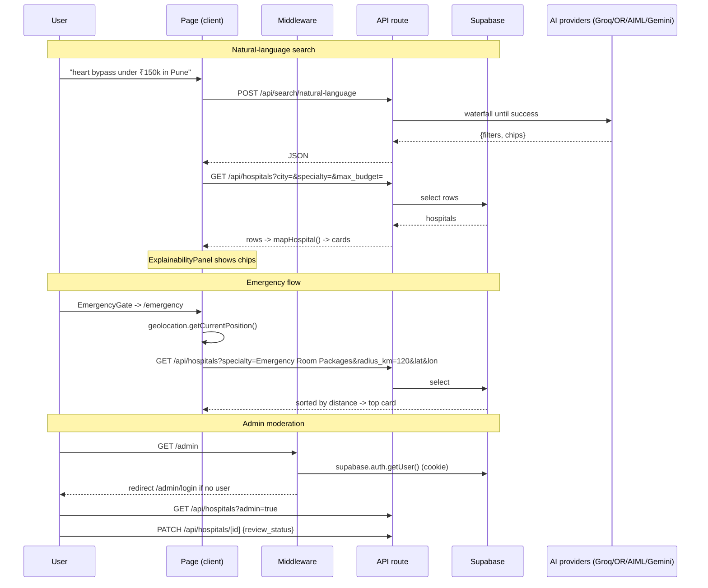
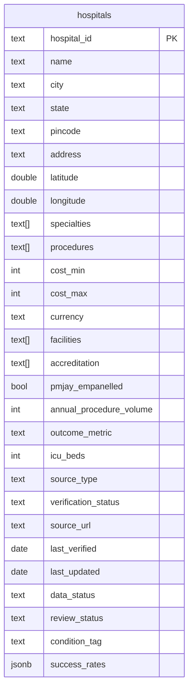

# CuraNav — Architecture Map

> Keep this beside you while developing CuraNav. Every path below is real and verified in this repo.

## 1. Tech Stack

- **Framework:** Next.js 16.3.5, App Router (`src/app`, RSC + client components)
- **UI:** React 19.2.8, TypeScript, Tailwind CSS 4 (`src/app/globals.css`), shadcn/ui style `base-nova` (uses `@base-ui/react`), framer-motion, lucide-react, class-variance-authority, tw-animate-css
- **Data:** Supabase (Postgres + Auth) via `@supabase/supabase-js` + `@supabase/ssr`
- **AI:** `@google/genai` (Gemini SDK) + raw HTTP to Groq / OpenRouter / AIML API (OpenAI-compatible `/chat/completions`)
- **Data tooling:** `papaparse` (CSV parse in browser), local scripts in `scripts/`
- **Map/library notes:** `leaflet`, `react-leaflet` are declared in `package.json` but **not used** anywhere in `src/` yet; the empty `src/app/map/` folder is not a real route (no `page.tsx`).
- **`AGENTS.md` warning:** this is a newer Next.js than your training data — consult `node_modules/next/dist/docs/` before writing framework code.

## 2. Frontend entry point

- **App shell:** `src/app/layout.tsx` — fonts, global `dark` class, metadata. Mounts `<Chatbot />` and `<EmergencyGate />` on **every** page. It does **not** render Header/Footer.
- **Home:** `src/app/page.tsx` (client component). Header + `<main>` sections (HeroSearch, StatStrip, AurixScrollCanvas, BrowseByCondition, HowItWorks, WhyChooseUs, Testimonials, AppDownloadCTA, FAQ) + Footer.
- Each page renders its own `<Header />` / `<Footer />` (`src/components/Header.tsx`, `Footer.tsx`). If you add a page, include both.

## 3. Backend entry point

- **API routes:** `src/app/api/<route>/route.ts` — all server-side logic and data access.
- **Server components** can read the DB directly: `src/app/hospital/[id]/page.tsx` uses `supabaseAdmin` to fetch a row during render.
- **Edge auth gate:** `src/middleware.ts` runs on every request (matcher excludes static/images).

## 4. Main routes / pages

| Route | File | Notes |
|---|---|---|
| `/` | `src/app/page.tsx` | Homepage |
| `/search` | `src/app/search/page.tsx` | Search results, NL-query mode, filters, compare selection |
| `/find-hospital` | `src/app/find-hospital/page.tsx` | Location-based "nearest hospital" finder |
| `/hospital/[id]` | `src/app/hospital/[id]/page.tsx` | Detail page — **server component** (supabaseAdmin) |
| `/compare` | `src/app/compare/page.tsx` | Compare 2–5 hospitals + AI summary (`?ids=`) |
| `/emergency` | `src/app/emergency/page.tsx` | Emergency nearest-hospital flow (specialty `Emergency Room Packages`) |
| `/admin` | `src/app/admin/page.tsx` | Admin dashboard (protected) |
| `/admin/login` | `src/app/admin/login/page.tsx` | Supabase password login |
| `/aurix` | `src/app/aurix/page.tsx` | "Coming soon" AI-vision placeholder |
| `/api/*` | `src/app/api/**/route.ts` | All API routes (below) |

## 5. API routes

| Route | Method | Purpose |
|---|---|---|
| `/api/hospitals` | GET | Search with filters: `city`, `specialty`, `condition`, `max_budget`, `facilities`, `verified_only`, `north/south/east/west` radius, `radius_km`, `lon`, `lat`, `sort` (distance/cost). `admin=true` bypasses filters, returns all rows (auth-checked). |
| `/api/hospitals` | POST | Add one hospital (admin). Also geocodes address via Nominatim when no coords given. |
| `/api/hospitals/[id]` | GET | Single hospital by id. |
| `/api/hospitals/[id]` | PATCH | Update `review_status` (`pending`/`approved`/`rejected`) — admin moderation. |
| `/api/hospitals/bulk` | POST | Bulk CSV import (PapaParse client-side → payload). |
| `/api/search/natural-language` | POST | AI turns a free-text query into `{ filters, explanation: { query, chips } }` (**waterfall**: Groq → OpenRouter → AIML → Gemini → `localExtract()` fallback). |
| `/api/compare/ai` | POST | Side-by-side comparison explanation for 2–5 hospital ids (**waterfall**: Groq → OpenRouter → Gemini). |
| `/api/chat` | POST | Site chatbot (Groq, `GROQ_API_KEY_2`, model `qwen/qwen3.8-27b`), receives page context. |
| `/api/stats` | GET | Homepage platform stats (consumed by `usePlatformStats`, 30s cache). |

## 6. Authentication flow

Supabase Auth, email + password. **No roles** — any signed-in user is treated as admin.

1. User visits `/admin` → `src/middleware.ts` runs `supabase.auth.getUser()` with cookie session. `/admin` (except `/admin/login`) → redirects to `/admin/login` if no user.
2. `/admin/login` calls `signInWithPassword` through the browser client (`src/lib/supabase-browser.ts`).
3. Server routes re-check the session with `src/lib/supabase-server.ts` (cookie-based `createServerClient`) rather than trusting the client.
4. Privileged writes/reads go through server API routes; `src/lib/supabase.ts` exports the **service-role** `supabaseAdmin` client (used for powerful queries/writes server-side only).

## 7. Main services

| File | Role |
|---|---|
| `src/lib/supabase.ts` | `supabaseAdmin` (service role) + default anon client |
| `src/lib/supabase-browser.ts` | Browser client (login, client-side reads) |
| `src/lib/supabase-server.ts` | SSR/cookie client for middleware + server code |
| `src/lib/mapHospital.ts` | **Single mapper** DB row → `Hospital` type — update here if schema changes |
| `src/lib/costEstimator.ts` | Rule-based cost estimate by specialty |
| `src/lib/userLocation.ts` | Persists location in `localStorage` (`curanav:user-location`) |
| `src/lib/facilityIcons.ts` | Icon mapping per facility |
| `src/lib/utils.ts` | `cn()` helper |
| `src/hooks/usePlatformStats.ts` | Fetches `/api/stats` with 30s in-memory cache |
| `mockHospitals.ts` (root) | `Hospital` type + 79 real NHA PMJAY records (source: hem.nha.gov.in) |
| `src/lib/mockHospitals.ts` | Shim re-exporting only **types** from root — the raw array must not be used by pages |

## 8. Database tables / entities

**One table: `hospitals`** (Supabase Postgres). Schema: `Supabase/curanav_schema.sql`; migrations: `Supabase/curanav_migration_real_data.sql`, `..._review_status.sql`, `..._success_rates.sql`.

Columns: `hospital_id` (PK, text), `name`, `city`, `state`, `pincode`, `address`, `latitude`, `longitude`, `specialties[]`, `procedures[]`, `cost_min`, `cost_max`, `currency`, `facilities[]`, `accreditation[]`, `pmjay_empanelled`, `annual_procedure_volume`, `outcome_metric`, `icu_beds`, `source_type`, `verification_status`, `source_url`, `last_verified`, `last_updated`, `data_status`, `review_status` (pending/approved/rejected), `condition_tag`, `success_rates` (jsonb). Indexes on `city`, GIN on `specialties`/`facilities`, `verification_status`, `review_status`.

## 9. External services

- **Supabase** — Postgres + Auth (session cookies `sb-*`).
- **Groq** — `api.groq.com/v1/chat/completions` (chat, NL search, compare).
- **OpenRouter** — `openrouter.ai/api/v1/chat/completions` (NL search, compare).
- **AIML API** — `api.aimlapi.com/v1/chat/completions` (NL search only).
- **Google GenAI (`@google/genai`)** — `generateContent` structured output (Gemini; NL search + compare as fallback).
- **OpenStreetMap Nominatim** — address → lat/lon geocoding when adding hospitals without coords.
- **Browser Geolocation API** — user location for `/emergency` and `/find-hospital`.

## 10. Environment variables (names only)

In `.env.local`: `NEXT_PUBLIC_SUPABASE_URL`, `NEXT_PUBLIC_SUPABASE_ANON_KEY`, `SUPABASE_SERVICE_ROLE_KEY`, `OPENROUTER_API_KEY`, `GROQ_API_KEY_2`.

The code scans the env for **key prefixes**, so any of these applies: `GROQ_API_KEY*`, `OPENROUTER_API_KEY*`, `AIML_API_KEY*`, plus the exact `GEMINI_API_KEY`.

**⚠ Security note:** `scripts/seed-db.js` has a hardcoded Supabase service-role key committed in the repo — don't paste secrets into files; read from `.env.local` like `scripts/geocode-hospitals.ts` does.

## 11. Most important files

- `src/app/layout.tsx` — global shell (Chatbot + EmergencyGate on every page)
- `src/middleware.ts` — the only auth gate
- `src/app/api/hospitals/route.ts` + `[id]/route.ts` — search + moderation core
- `src/app/api/search/natural-language/route.ts` — AI query parsing + fallback chain
- `src/lib/mapHospital.ts` — DB ↔ type translation point
- `mockHospitals.ts` (root) — canonical `Hospital` shape
- `Supabase/curanav_schema.sql` — table definition
- `scripts/import-csv.js` — regenerates seed data from `Dataset csv files/*.csv`

## 12. Main data flows

1. **NL search** — `HeroSearch`/`/search` → optional `POST /api/search/natural-language` → `{filters, chips}` → `GET /api/hospitals?...` → Supabase rows → `mapHospital()` → `HospitalCard` grid. `ExplainabilityPanel` renders the AI's chips; Edit Search re-runs. Falls back to `localExtract()` when all AI providers fail.
2. **Compare** — `CompareBar` (sticky bottom, state) → `/compare?ids=a,b,c` → `GET /api/hospitals/[id]` per id + `POST /api/compare/ai` → comparison table + AI summary.
3. **Emergency** — `EmergencyGate` (sessionStorage, once/session) → `/emergency` → browser geolocation → `GET /api/hospitals?specialty=Emergency Room Packages&radius_km=120&lat&lon` → sorted by distance → `EmergencyHospitalCard` (top result highlighted).
4. **Admin moderation** — `/admin` (middleware gate) → `GET /api/hospitals?admin=true` → approve/reject via `PATCH /api/hospitals/[id]` (`review_status`); add via `POST /api/hospitals` (`AddHospitalModal`); bulk via `POST /api/hospitals/bulk` (`CsvUploadModal`).
5. **Chatbot** — global → scrapes `<main>` text + URL → `POST /api/chat` (Groq) → reply.
6. **Stats** — `StatStrip` → `usePlatformStats()` (30s cache) → `GET /api/stats`.

## 13. Where to add…

- **New page** → `src/app/<route>/page.tsx` (client unless it needs server-side DB reads; import `Header`/`Footer`). Chatbot + EmergencyGate apply automatically.
- **New server logic / JSON endpoint** → `src/app/api/<route>/route.ts`.
- **New hospital query** → reuse `GET /api/hospitals` — do **not** read the root `mockHospitals` array in components.
- **Schema change** → edit `Supabase/curanav_schema.sql`, add a new migration file, **and** update `src/lib/mapHospital.ts`.
- **New/real data** → replace CSVs in `Dataset csv files/`, run `scripts/import-csv.js` to regenerate `mockHospitals.ts` + `Supabase/curanav_seed_data.sql`.
- **New AI provider** → follow the provider-push pattern in `src/app/api/search/natural-language/route.ts` (list keys with prefix, waterfall loop, continue on error).

---

## Diagrams

Standalone Mermaid sources (rendered inline below, also available as `.mmd` files):

- [architecture.mmd](architecture.mmd) — high-level architecture
- [request-dataflow.mmd](request-dataflow.mmd) — request / data-flow sequence
- [database-er.mmd](database-er.mmd) — database ER diagram

### A. High-level architecture

```mermaid
flowchart LR
    subgraph Browser
        UI[Next.js pages & components<br/>page.tsx / components/*]
        G[Browser Geolocation]
    end
    subgraph NextJS[Next.js App (App Router)]
        API[API routes<br/>src/app/api/**/route.ts]
        MID[src/middleware.ts<br/>admin auth gate]
        SVC[Server components<br/>e.g. hospital/[id]]
        UL[userLocation.ts<br/>localStorage]
    end
    DB[(Supabase Postgres<br/>table: hospitals)]
    AUTH[SupaAuth<br/>email+password]
    subgraph AI[AI Providers]
        GROQ[Groq]
        OR[OpenRouter]
        AIML[AIML API]
        GEM[Gemini @google/genai]
    end
    NOM[Nominatim OSM<br/>geocoding]

    UI --> API
    UI --> MID
    MID --> AUTH
    SVC --> DB
    API --> DB
    API --> AUTH
    API --> GROQ & OR & AIML & GEM
    API --> NOM
    G --> UI
    UI --> UL
```

### B. Request / data-flow diagram



### C. Database ER diagram



## D. If you are lost — start here

1. `src/app/layout.tsx`
2. `src/middleware.ts`
3. `src/app/api/hospitals/route.ts`
4. `src/app/api/search/natural-language/route.ts`
5. `src/lib/mapHospital.ts`
6. `mockHospitals.ts` (root)
7. `src/lib/supabase.ts` (+ browser/server variants)
8. `Supabase/curanav_schema.sql`
9. `src/components/HospitalCard.tsx`
10. `scripts/import-csv.js`

## E. 60-second explanation

CuraNav is a Next.js App Router app that turns free-text queries into hospital lookups. The UI lives in `src/app` + `src/components`; every request-like action goes through `src/app/api/**/route.ts`. Search starts with natural-language parsing (`/api/search/natural-language`) that tries Groq → OpenRouter → AIML → Gemini and falls back to a local keyword extractor, producing structured filters the `/api/hospitals` route applies against the single Supabase `hospitals` table. Results are mapped to the shared `Hospital` type by `mapHospital.ts` (never the raw mock array). Compare, emergency, and chatbot flows all reuse the same API routes and AI-waterfall pattern. `middleware.ts` protects `/admin`; any authenticated Supabase user is an admin. The homepage, chatbot, and emergency gate are global — two AI providers (Groq, Gemini) power most features, with OpenRouter/AIML as device-diverse fallbacks for resilience during the hackathon demo.